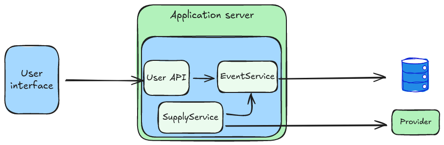

# Fun events project
[pipeline status](https://github.com/mblancoa/java-fun-events/actions)


## Project structure
Fun events implements a hexagonal architecture and is distributed in several modules:

```
fun-events
|-- fun-events-domain
|-- fun-events-mongodb-repository-adapter
|-- fun-events-xxx-provider-adapter
|-- fun-events-api
|-- fun-events-start-app
```
### fun-events-domain
Implements the business logic and defines ports to connect with external services

```
com.funevents
|-- configuration
|   |-- DomainConfiguration
|
|-- model
|   |-- Event
|
|-- EventService               -> implements business logic
|-- SupplyService              -> implements the supply business logic
|-- EventRepository            -> defines the repository port to persistence
|-- EventProvider              -> defines the provider port to supply events by http requests
```
### fun-events-mongodb-repository-adapter
Contains the implementation of the EventRepository port for mongoDB persisence

```
com.funevents
|-- configuration
|   |-- MongoDBRepositoryConfiguration
|
|-- mongodbrepository
    |-- model
    |   |-- Constants
    |   |-- EventDB                  -> representative object of mongodb Events collection
    |   |-- EventOut                 -> representative object of special projection
    |
    |-- EventRepositoryAdapter       -> implements the EventRepository port
    |-- MongoDBEventMapper           -> map objects from mongodb's model to domain's model

```
### fun-events-xxx-provider-adapter
Contains the implementation of the EventPovider port for the specific provider named `xxx`

```
com.funevents
|-- configuration
|   |-- XxxProviderConfiguration
|
|-- xxxprovider
    |-- model                       -> contains the model to represent then provider's API responses
    |   |-- ProviderResponse
    |   |-- Output
    |   |-- BasePlan
    |   |-- Plan
    |   |-- Zone
    |
    |-- EventProviderAdapter        -> implements the EventProvider port
    |-- XxxProviderEventMapper      -> map objects from provider's model to domain's model

```
### fun-events-api
Contains the implementation of the API 

```
com.funevents
|-- configuration
|   |-- ApiConfiguration
|
|-- api
    |-- model
    |   |-- EventResponse
    |   |-- EventSummay                  
    |   |-- EventList                 
    |   |-- Error                 
    |
    |-- EventController              -> implements API methods
    |-- ApiExceptionHandler          -> manages the errors produced during request flow
    |-- ApiEventMapper               -> map objects from API model to domain's model
```
### fun-events-start-app
Contains the class to configure and run the main application

```
com.funevents
|-- startapp
    |
    |-- EventStartAppApplication     -> class based on spring boot to load configuration and run the application
    |-- application.yml              -> properties file          

```
## Logic business description
TODO

## How to run it
- 1- Configure the application.yml file correctly (fun-events-start-app -> src/main/resources/application.yml)
- 2- Execute `make build` to build the package
- 3- Execute `make deploy` to run the application with docker-compose
- 4- Connect to `http://localhost:8080/swagger-ui/index.html`
- 5- Excecute `make stop`to shutdown the network

